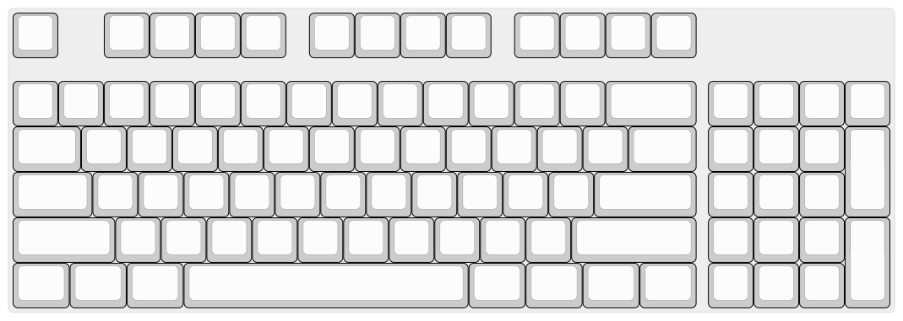
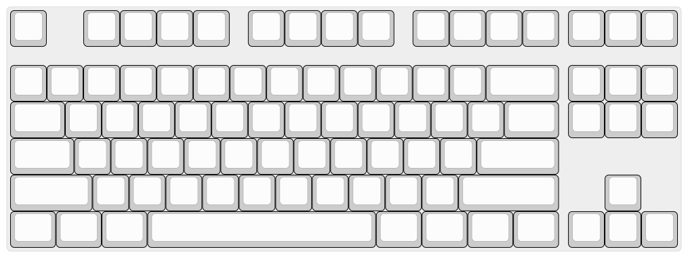
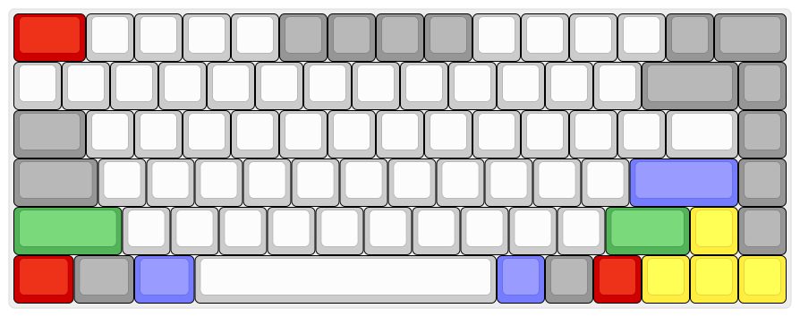
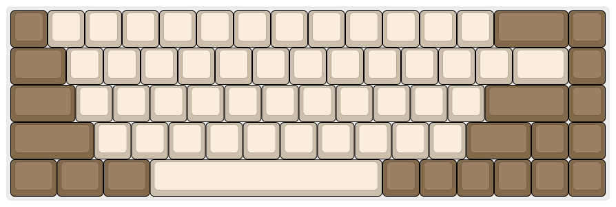
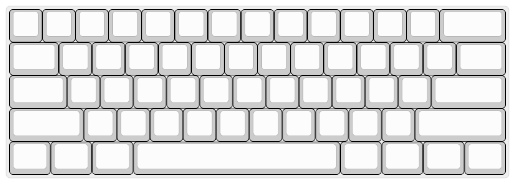
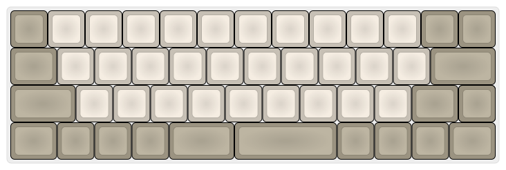
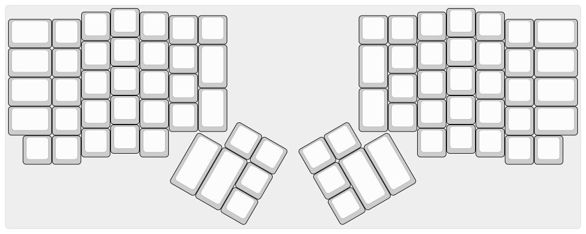

# FAQ

## Предисловие
Мнения и вкусы у всех разные. В данной статье мы постарались привести максимально объективную выжимку по каждому вопросу, но тем не менее, здесь будут фрагменты личного мнения авторов.
Если у вас возникнут любые дополнительные вопросы, не стесняйтесь задавать их в нашем [чате](https://t.me/ru_mechcult).

## Что такое механическая клавиатура?
Широко распространённые недорогие клавиатуры устроены достаточно просто. Клавиша давит через резиновый купол на мембрану, состоящую из двух слоёв с дорожками и контактными площадками и промежуточного слоя, изолирующего дорожки верхнего и нижнего слоёв друг от друга. В самых дешёвых клавиатурах может применятся однослойная мембрана. Подобная конструкция очень дёшева в производстве, но имеет ряд недостатков:

* Для срабатывания клавишу необходимо нажимать до упора, что способствует быстрой утомляемости при продолжительной работе с клавиатурой.
* Резиновые куполы со временем изнашиваются, теряя эластичность. Клавиши теряют тактильность, приходится прилагать большее усилие для срабатывания.
* Изнашивается мембрана, токопроводящие дорожки и площадки на ней окисляются. Большинство мембранных клавиатур отличаются крайне низкой ремонтопригодностью.

Сейчас в большинстве случаев под механической клавиатурой подразумевается устройство на базе дискретных переключателей, состоящих из корпуса и подпружиненного штока, нажатие на который обеспечивает замыкание металлической контактной пары или срабатывание безконтактного датчика (оптического, магнитного, емкостного).

Есть несколько исключений. Во-первых, это емкостные клавиатуры на базе переключателей Topre (клавиатуры Realforce, HHKB и «китайские Topre» в клавиатурах Plum). Под клавишами в таких клавиатурах расположены резиновые куполы, обеспечивающие тактильность, но вместо замыкания контактов контроллер измеряет изменение ёмкости между контактными площадками на печатной плате, что помимо надёжности обеспечивает главное свойство механических клавиатур — срабатывание клавиши без необходимости нажатия до упора.

Ещё одно исключение — механизм buckling spring over membrane, встречающийся в клавиатурах IBM Model M и Unicomp. В этих клавитурах используется обычная трёхслойная мембрана, но на контактные площадки нажимает ударник, к которому под углом присоединена пружина. При нажатии клавиши усилие возрастает до тех пор, пока пружина резко не сложится внутри направляющей, толкая ударник.

## Зачем нужны механические клавиатуры?
Наверное, каждый решает сам для себя, для чего ему механическая клавиатура, и причину, по которой вам нужна именно механика должны придумать для себя именно вы сами. Убедить человека в необходимости покупки механики удаётся крайне редко, практически единственным работающим аргументом является возможность попробовать клавиатуру в работе.
Тем не менее, можно перечислить несколько преимуществ механических клавиатур:

 * Эргономика. Большее удобство при наборе обеспечивают механизм работы переключателей (клавишу не нужно продавливать до упора) и разнообразие форм-факторов.
 * Возможность выбрать то, что нравится лично вам: характеристики переключателей (в том числе под разные клавиши), размер и форм-фактор клавиатуры, цвет и материал, из которого выполнены клавиши и корпус. Большая часть основных компонентов современных клавиатур (переключатели, [клавиши](keycaps.md), [стабилизаторы](stabs.md)) стандартизированы, что открывает широкие возможности по доработке готовых продуктов и созданию уникальных клавиатур.
 * Высокая надежность. Ресурс механических переключателей очень высок, но не стоит рассматривать это как серьёзный аргумент в пользу покупки какой-то клавиатуры, на практике это никак не сказывается на долговечности. Здесь надежность связана с простотой конструкции, её отказоустойчивостью и ремонтопригодностью. Качественная резиномембранная клавиатура может прослужить дольше, чем дешёвая механика с Aliexpress (или даже недешёвая от геймерских брендов), но практически любую неисправность механической клавиатуры можно устранить.

## Хорошо, мне нужна механика. Какую мне взять?
Если вы определились с выбором форм-фактора и переключателей, то быстрее и проще будет [купить](купить) готовую клавиатуру, среди которых можно выделить несколько категорий:
* Дорогие игровые клавиатуры Hyper-X, Razer, Corsair, Logitech, Thermaltake, Lenovo и других брендов. Встретить эти клавиатуры можно во многих сетевых магазинах электроники. Соотношение цена/качество у них, как правило, невысокое. Крашеные клавиши, быстро теряющие товарный вид; нестандартный нижний ряд клавиш; аляповатый дизайн; ужасный софт.
Маркетинговую чепуху вроде обязательной необходимости NKRO, заоблачной частоты опроса и прочих фич не стоит воспринимать всерьёз. Практически любая современная механическая клавиатура обеспечивает минимум 6KRO, частота опроса на практике значения не имеет.
* Дешёвые китайские клавиатуры: James Donkey, Rantopad, Motospeed, Teamwolf. Как правило, имеют неважное качество изготовления: скрипящие корпуса, гремящие стабилизаторы, плохая пайка. Конечно, они будут лучше, чем мембранные клавиатуры до 1000 рублей, при жёстком ограничении по бюджету их можно рассматрировать. Тут вы хотя бы не переплатите за бренд.
* Середнячки: iKBC, Cooler Master, Obins, Ducky. Пожалуй, лучшие клавиатуры в соотношении цена/качество. Очень заметный скачок по качеству с предыдущей категорией. Они проигрывают топовым брендам, но как правило отставание не так уж и велико и в основном сводится к чуть худшим стабилизаторам, материалам кейкапов и корпуса и ограниченной программируемости.
* High-End клавиатуры от ведущих брендов: Varmilo, Vortex, Leopold, Filco, Das, Realforce. Они объединяют в себе превосходные материалы и высочайшее качество сборки, и, как правило, целый вагон полезных функций, таких как полная программируемость или наличие нескольких профилей для работы с разными устройствами.
* Экзотика. Соотношение цена/качество падает за счёт наценки за культовость или необычный форм-фактор. Примеры: HHKB (известная 60%-клавиатура на Topre), Kinesis Advantage и Maltron (эргономичные клавиатуры).
* Комплекты для сборки (DIY kits). Почти готовые клавиатуры, требующие умения работать с паяльником. От недорогих 60% в пластиковых корпусах ценой менее $100 до уникальных мелкосерийных клавиатур. Комплект стоит рассматривать в том случае, если вам не хватает уровня кастомизации, предлагаемой производителями готовых клавиатур, и нужны: [полная программируемость](QMK.md), свободный выбор переключателей (или даже совмещение нескольких типов переключателей в одной клавиатуре), [клавиш](keycaps.md) и корпусов. Как правило, продавцы комплектов предлагают услугу по сборке клавиатуры — хороший вариант для тех, кто не уверен в собственных силах и хочет избежать возможных проблем с совместимость.
* Полностью самодельные клавиатуры. При наличии необходимых навыков вы можете спроектировать собственную клавиатуру с нуля: нарисовать раскладку, изготовить корпус (например, лазерной резкой из акрила), печатную плату, модифицировать одну из существующих прошивок.

Коротко: лучшее соотношение цена/качество на рынке в данный момент – это Anne Pro 2, особенно если поймать её на распродаже/групбае. Неплохим вариантом станут клавиатуры из линейки Masterkeys от Cooler Master.

## Какие переключатели мне подходят?
Лучший способ понять — попробовать. В идеале — на клавиатуре, но полезно будет знать немного теории.

### Основные типы и характеристики переключателей

* **Кликающие**. Именно с ними в первую очередь у большинства ассоциируются механические клавиатуры. В большинстве современных модульных переключателей за клик отвечают специальный выступ на штоке, давящий на упругую пластину. Усилие сначала нарастает линейно, затем выступ начинает давить на кликер и усилие возрастает с большей скоростью, затем кликер срабатывает (во многих конструкциях пластина ударяет о корпус переключателя), замыкается контактная пара и усилие снижается, так как выступ уже прошёл через кликер. При нажатии на клавишу с кликающим переключателем пользователь получает тактильную отдачу, чувствуя по «бугорку», что клавиша сработала, и звуковую отдачу. Можно достаточно быстро научится чувствовать момент срабатывания и не продавливать клавиши до упора, что существенно снизит утомляемости при продолжительной работе.
В зависимости от конкретной реализации механизма кликающий переключатель может щёлкать либо только на прямом ходе, либо дважды — на прямом и обратном. Множество пользователей считают кликающие переключатели наиболее удобными для набора текста, но у них есть существенный недостаток — шум, который может сильно не понравится окружающим.
Самые известные кликающие переключатели: Cherry MX Blue и различные клоны Cherry MX производства Gateron, Kailh, Outemu и др. К ним же относятся и buckling spring, выделяющихся тем, что момент срабатывания точно совпадает с кликом, так как за замыкание, тактильность и клик отвечает один и тот же простой механизм, состоящий из пружины и ударника.

* **Тактильные**. Если немного изменить конструкцию переключателя — так, чтобы пластина не ударяла о корпус, то мы получим тактильный переключатель без щелчка. К тактильным переключателям относятся и резиновые куполы даже в простейших резино-мембранных клавиатурах, но основная цель тактильности — не продавливать клавиши до упора — будет достигнута только с механическими переключателями или емкостными. Важной характеристикой простых тактильных и кликающих переключателей является уровень их тактильности. Недостаточная тактильность будет плохо восприниматься, чрезмерная тактильность в виже жёсткой ступеньки будет утомлять при продолжительном наборе.
Распространённые тактильные переключатели — Cherry MX Brown и клоны, Topre.

* **Линейные**. Всё просто: пружина сжимается, усилие плавно нарастает, ближе к концу хода происходит замыкание контактов. Линейные переключатели нравятся геймерам (тактильность, как правило, им только мешает) и тем, кому просто не нравится тактильные переключатели.

Немаловажную роль играет жёсткость пружины, используемой в переключателях. Идеала, подходящего для всех, тут не существует. При слишком лёгких для вас пружинах переключатели будут срабатывать от случайных прикосновений, появится много опечаток, «поймать» тактильность будет гораздо тяжелее и будет много нежелательных нажатий до упора.

Клавиатуры можно найти у крупных ритейлеров. Если их в вашем городе нет, то можно заказать свитчтестер — небольшой корпус с несколькими переключателями разных типов. Но к сожалению, использование свитчтестера не передает полностью все ощущения от переключателей, и на клавиатуре они всегда будут ощущаться немного по-другому (в основном, за счет того, что вы нажимаете всеми пальцами, а не только одним).

Важно понимать, что не бывает переключателей, которые подходят лучше для набора текста, когда другие больше подходят для игр.
Все это разнообразие в мире механических клавиатурах нужно только для одного — **выбрать то, что нравится**, и переключатели вам нужно выбрать те, **что вам нравятся**. Иначе какой в этом смысл?

### Правда ли что переключатели Cherry лучше китайских клонов?
На этот вопрос нет однозначного ответа.
* Ещё года три назад можно было сказать, что Cherry гораздо надёжнее, чем аналоги. Следует осторожно относиться к покупке старых клавиатур на переключателях Kailh и Outemu — было много жалоб на низкий ресурс, переключатели теряли клик, начинали двоить и т. п. При этом Cherry тоже были далеки от идеала — плавность линейных переключателей Cherry постепенно падала с середины 1990-х годов и энтузиасты начали ценить т.н. «винтажные Cherry MX Black», переключатели, выпущенные в 1980-х — начале 1990-х.
* Со временем конкуренция заставила практически всех известных производителей улучшить качество, расширить ассортимент и снизить цены. В настоящее время достойной заменой Cherry являются переключатели Gateron и производимые им же Zealio. Интересные в плане характеристик переключатели выпускает Kaihua (например, Kailh Box). У Outemu долго были нарекания по качеству, но их репутация постепернно улучшается. Cherry тоже исправился — в 2017 году появились переключатели, изготовленные на новом оборудовании, почти все проблемы с плавностью хода удалось устранить.

## Какие раскладки бывают и какие из них удобнее?

Раскладки — стандарты количества клавиш на клавиатуре и их расположения.

Самые распространённые стандартные раскладки:

### Fullsize

Полноразмерная раскладка, где есть и цифровой блок (нампад), и F-ряд. Изначально в классической полноразмерной раскладке было 101/102 клавиши (в вариантах ANSI и ISO), позже к ним добавилось ещё три (две GUI и Menu).

*Раскладка ANSI 104:*

### Я привык к большому Enter'у, не хочу ничего менять!
Выше вы видели раскладку ANSI, которая появилась и используется, в основном, в США: горизонтальный Enter, длинный 2,25U левый Shift, backslash на Enter. Основных видов раскладок с «большим Enter» существует два:
* ISO. Используется в большинстве европейских стран. Вертикальный Enter, бэкслеш слева от него, короткий левый Shift с дополнительной клавишей non-US backslash. Никаких объективных преимуществ при использовании стандартной логической раскладки для русского языка у ISO перед ANSI нет, так как non-US backslash выполняет функции обычного backslash, так что выбор в пользу ISO определяется лишь привычкой.
*Раскладка ISO 105:*

* Asian (big ass Enter — «толстозадый Enter»). Enter в виде перевёрнутой «Г», гибрид ANSI и ISO. Места под backslash уже не остаётся, так что его помещают выше, уменьшая Backspace до 1U. В настоящее время подобная раскладка считается экзотикой и в мире механических клавиатур практически не встречается. Даже если вам удастся найти, например, SteelSeries 7g, то вы столкнётесь с невозможностью найти набор клавиш под неё. Переходите на ANSI или ISO.

*Раскладка Asian 104:*

### "Compact fullsize"/90%

Навигационный блок интегрирован в цифровой, или навигационные стрелки помещены между изменённым нижним рядом и цифровым блоком.
*Клавиатура Cooler Master Masterkeys PRO M, 92 клавиши*

### TKL/80%

87/88 клавиш. Из раскладки убран цифровой блок.

*Раскладка ANSI TKL*

### 75%

75 клавиш. Переформированный навигационный блок и правая часть нижнего ряда.

*Раскладка Vortex Race 3*

### 65%

65-68 клавиш. Точно такая же, как и 75 только без F-ряда или видоизменённый и перемещённый навигационный блок.

*Раскладка Tada68*

*Раскладка Leopold FC660*

### 60%

61-65 клавиш. Из раскладки убраны навигационный блок и F-ряд.

*Раскладка ANSI 60%*

### 40%

40–50 клавиш. Убран цифровой ряд. Среди таких небольших клавиатур наблюдается большое многообразие.

*Клавиатура Vortex Core, 48 клавиш*

Очевидно, что все эти раскладки отличаются лишь тем, что в них нет/есть определённые группы клавиш.
Но так же внутри одной раскладки могут быть небольшие отличия.
Например, в игровых клавиатурах нижний ряд может быть нестандартным, клавиши Alt, Ctrl, и Win могут отличаться по размеру от классической ANSI/ISO 104/105, что создаёт трудности и поиске совместимых наборов клавиш.

Может быть несколько причин, по которым вы захотите купить неполноразмерную клавиатуру:

* Сэкономить место на столе. Особенно это актуально при переходе с Fullsize на TKL, пространства для мыши становиться заметно больше. Так же это касается тех случаев, когда стол небольшой и разместить всё на нем невозможно.

* Вы не пользуетесь этими клавишами. Обычно это касается цифрового блока, либо навигационных клавиш. Когда вы в последний раз осознанно нажимали Scroll Lock? Даже если цифровой блок вам всё же необходим время от времени, его можно докупить отдельно и расположить в любом месте — слева от клавиатуры или справа от мыши.

* Компактность при переноске. Маленькую клавиатуру проще носить с собой. Если вы носите клавиатуру из дома на работу каждый день, то чем будет она меньше — тем лучше.

### Прочие раскладки
Модульная конструкция позволяет легко создавать любые раскладки. Фантазия ограничивается лишь стандартными размерами клавиш. Кто-то располагает цифровой блок слева, другие убирают смещение рядов клавиш (ортолинейные раскладки), существует большое разнообразие эргономичных клавиатур, создатели которых пытались радикально улучшить удобство пользования клавиатурой, располагая клавиши на плоскости (и в пространстве) самым причудливым образом.

*Раскладка Ergodox:*

### Компактная клавиатура — это хорошо, но как вы живёте без F-клавиш, а тем более без стрелочек?
Нужных клавиш вас никто не лишает, просто они расположены в другом слое. С концепцией переключения слоёв знаком каждый, кто пользовался ноутбуком. Практически на любой ноутбучной клавиатуре есть клавиша Fn, при удержании которой клавиши выполняют дополнительные функции. С компактными клавиатурами то же самое. Например, в 60%-клавиатурах F-ряд совмещён с цифровым рядом, стрелки находятся на Fn+WASD или IJKL (любители Vim размещают их в один ряд на HJKL). Использование слоёв, с одной стороны, увеличивает сложность использования клавиатуры за счёт необходимости в дополнительных нажатиях клавиш, с другой — улучшает эргономичность, так как руки перемещаются на меньшие расстояния.
